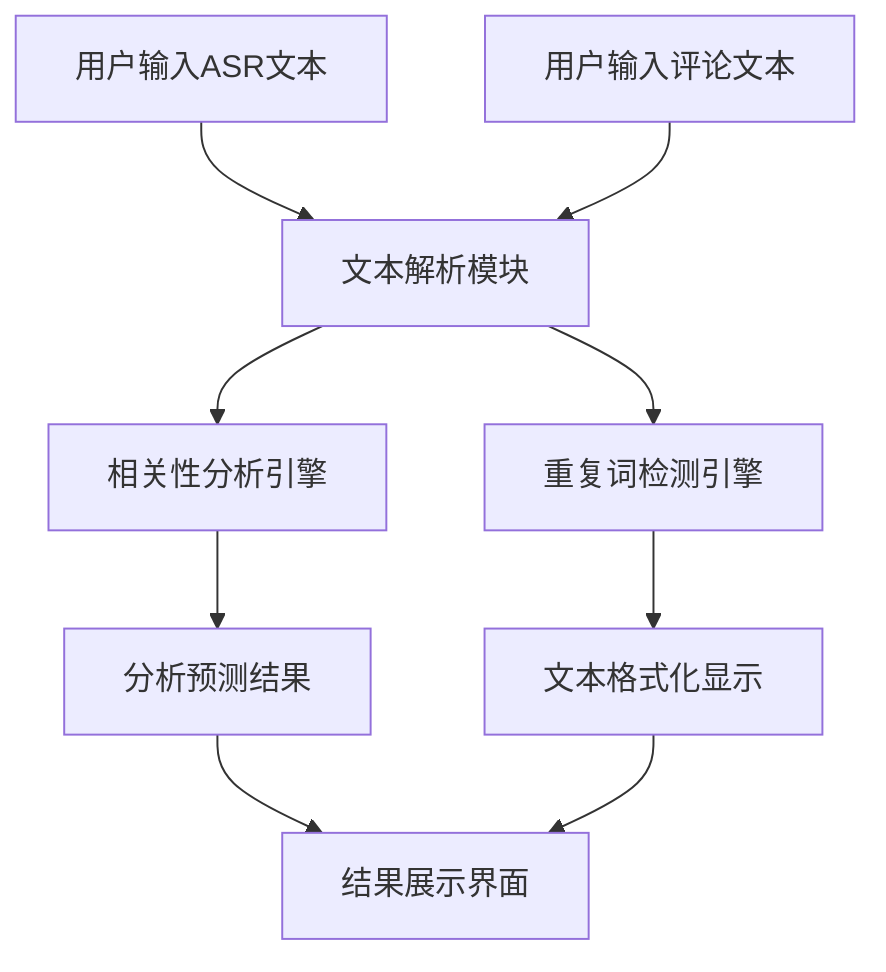

# 互动解析产品设计文档

## 1. 产品概述

### 1.1 产品名称
**互动解析**

### 1.2 产品定位
智能分析ASR（语音识别）文本与评论文本的相关性分析工具，专门用于检测和识别互动内容的重复性和逻辑关系。

### 1.3 目标用户
- 内容创作者和主播
- 社交媒体运营人员
- 数据分析师
- 产品运营团队

## 2. 产品架构设计

### 2.1 整体架构
产品采用单页面应用（SPA）架构，分为三个核心模块：

```
┌─────────────────────────────────────────────────────────┐
│                    互动解析系统                          │
├─────────────────────────────────────────────────────────┤
│  ┌─────────────┐  ┌─────────────┐  ┌─────────────┐    │
│  │  标题模块   │  │  输入模块   │  │  输出模块   │    │
│  └─────────────┘  └─────────────┘  └─────────────┘    │
└─────────────────────────────────────────────────────────┘
```

### 2.2 模块设计

#### 2.2.1 标题模块
- **功能**：显示产品名称和简介
- **内容**：产品logo + "互动解析" + 功能描述

#### 2.2.2 输入模块
- **布局**：三列网格布局
- **组件**：
  - ASR文本输入框
  - 评论文本输入框
  - 使用说明 + 解析按钮

#### 2.2.3 输出模块
- **布局**：两列网格布局
- **组件**：
  - 分析预测面板
  - 重复文本展示面板

## 3. 功能需求详细设计

### 3.1 输入模块功能设计

#### 3.1.1 ASR文本输入
- **字段名称**：输入ASR文本
- **输入格式**：`"句子1","句子2","句子3"`
- **示例数据**：
  ```
  "欢迎大家来到我的车展","今天给大家介绍一下这款车衣","3M的车衣确实不容易发黄"
  ```

#### 3.1.2 评论文本输入
- **字段名称**：输入评论文本
- **输入格式**：`"评论内容,？,时间戳"`
- **示例数据**：
  ```
  "3M的车衣不容易发黄,？,1748397004"
  "什么牌子的车衣最好,？,1748397010"
  "这个车衣多少钱,？,1748397020"
  ```

#### 3.1.3 使用说明
- **内容**：操作步骤和注意事项
- **操作按钮**：解析互动内容

### 3.2 输出模块功能设计

#### 3.2.1 分析预测模块

**功能1：相关性判断**
- **输出内容**：是否存在相关性的结论
- **判断逻辑**：
  - 若有相关性：输出判断原因和具体文本内容
  - 若无相关性：说明未检测到相关性

**相关性判断规则：**

1. **读评论检测**：
   - ASR文本与评论文本高度重复
   - 包含拼音相同（处理错别字问题）
   - 高度重复阈值：60%以上相似度
   - 副词连词等无意义词可忽略

2. **回答评论检测**：
   - **问答关系**：评论是问句，ASR是回答
   - **逻辑关系**：构成明确的逻辑关系
     - 对比关系：如"3M车衣不易发黄" vs "确实，XPEL容易发黄"
     - 因果关系：有明确的因果逻辑链
     - 排除模糊关系：如"XPEL车衣不耐用"或"我也买车衣"

#### 3.2.2 重复文本展示模块

**功能1：ASR文本格式化**
- **输入格式**：`"AAAA","BBBB"`
- **输出格式**：
  ```
  AAAA
  BBBB
  ```
- **处理逻辑**：提取双引号内文本，逗号分隔换行

**功能2：评论文本格式化**
- **输入格式**：`"评论内容,？,时间戳"`
- **输出格式**：`[北京时间] 评论内容`
- **样式要求**：时间文本颜色与评论文本区分

**功能3：重复词高亮**
- **检测规则**：
  - 仅标记ASR文本与评论文本间的重复
  - 最小重复单位：2个中文字符
  - 单字符重复不标记
- **高亮样式**：
  - 不同重复词使用不同颜色
  - 颜色透明度适中，不影响阅读
  - 支持10种颜色循环使用

## 4. 技术实现方案

### 4.1 前端技术栈
- **HTML5**：页面结构
- **CSS3**：样式设计（渐变、阴影、动画）
- **Vanilla JavaScript**：核心逻辑实现

### 4.2 核心算法

#### 4.2.1 文本相似度计算
- **算法**：最长公共子序列（LCS）
- **公式**：`similarity = (LCS * 2) / (text1.length + text2.length)`

#### 4.2.2 拼音相似度计算
- **方法**：字符级模糊匹配
- **错别字对应表**：常见同音字映射

#### 4.2.3 重复词检测
- **范围**：2-10字符长度的词组
- **去重**：按长度倒序排列
- **过滤**：排除纯标点符号

### 4.3 UI/UX设计

#### 4.3.1 设计风格
- **色彩方案**：渐变紫色主题（#667eea → #764ba2）
- **卡片设计**：圆角、阴影、悬停效果
- **响应式**：网格布局，自适应屏幕尺寸

#### 4.3.2 交互设计
- **输入反馈**：聚焦状态、错误提示
- **按钮效果**：悬停动画、点击反馈
- **结果展示**：渐进式加载、颜色编码

## 5. 数据流程设计



## 6. 性能与兼容性

### 6.1 性能要求
- **响应时间**：< 500ms
- **支持数据量**：单次处理最大10KB文本
- **内存占用**：< 50MB

### 6.2 兼容性要求
- **浏览器**：Chrome 70+, Firefox 65+, Safari 12+
- **设备**：桌面端、平板、手机
- **分辨率**：1024x768 以上

## 7. 测试用例

### 7.1 正向测试用例

**用例1：读评论场景**
- **ASR输入**：`"3M的车衣不容易发黄"`
- **评论输入**：`"3M车衣不易发黄,？,1748397004"`
- **期望结果**：检测到相关性（读评论）

**用例2：回答评论场景**
- **ASR输入**：`"确实，XPEL的车衣容易发黄"`
- **评论输入**：`"3M的车衣不容易发黄,？,1748397004"`
- **期望结果**：检测到相关性（回答评论-对比关系）

### 7.2 负向测试用例

**用例3：无关内容**
- **ASR输入**：`"今天天气不错"`
- **评论输入**：`"这个车衣多少钱,？,1748397004"`
- **期望结果**：无相关性

## 8. 部署方案

### 8.1 文件结构
```
interaction_analysis.html    # 主应用文件
assets/                      # 资源文件夹
├── icon.svg                # 产品图标
└── icon-32.png            # 备用图标
```

### 8.2 部署步骤
1. 创建产品文件
2. 更新主页导航链接
3. 提交Git仓库
4. 启动本地服务测试
5. 验证功能完整性

## 9. 后续优化计划

### 9.1 功能优化
- 增加更多文本相似度算法
- 支持批量文本处理
- 添加导出功能

### 9.2 性能优化
- 实现Web Worker处理大文本
- 添加缓存机制
- 优化算法效率

### 9.3 用户体验优化
- 添加实时预览
- 支持拖拽上传
- 增加快捷键操作 