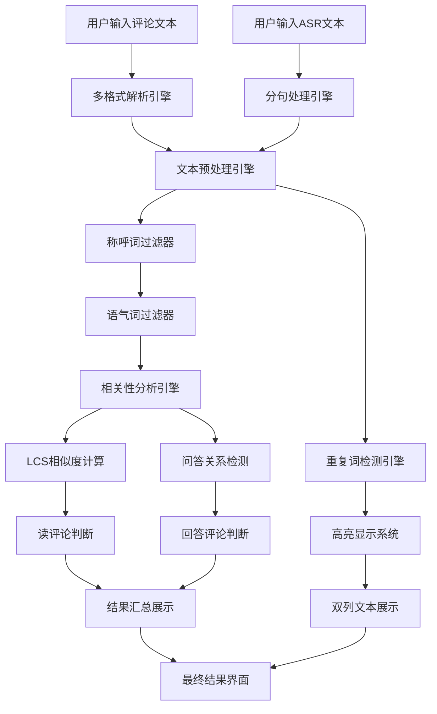

# 互动有效性分析设计文档

## 1. 产品概述

### 1.1 产品名称
**互动解析（互动有效性分析工具）**

### 1.2 产品定位
智能分析ASR（语音识别）文本与评论文本的相关性分析工具，专门用于检测互动内容的有效性，识别读评论和回答评论行为的时间先后关系和语义关联性。

### 1.3 目标用户
- 直播内容创作者和主播
- 社交媒体运营人员
- 互动数据分析师
- 产品运营和内容审核团队

### 1.4 核心价值
- **时间逻辑识别**：按照评论→ASR的时间流程分析互动有效性
- **智能文本过滤**：自动过滤称呼词、语气词等无关信息
- **分句精准匹配**：ASR文本按空格分句，逐句分析相关性
- **可视化展示**：重复词高亮，直观展示互动关系

## 2. 产品架构设计（V2.0 优化版）

### 2.1 整体架构
产品采用单页面应用（SPA）架构，分为三个核心模块：

```
┌─────────────────────────────────────────────────────────┐
│                 互动有效性分析系统                        │
├─────────────────────────────────────────────────────────┤
│  ┌─────────────┐  ┌─────────────┐  ┌─────────────┐    │
│  │  标题模块   │  │  输入模块   │  │  输出模块   │    │
│  │  产品介绍   │  │  时间逻辑   │  │  分析结果   │    │
│  └─────────────┘  └─────────────┘  └─────────────┘    │
└─────────────────────────────────────────────────────────┘
```

### 2.2 模块设计

#### 2.2.1 标题模块
- **功能**：产品品牌展示和功能说明
- **内容**：产品图标 + "互动解析" + 功能描述
- **样式**：渐变标题，现代化设计

#### 2.2.2 输入模块（优化版）
- **布局**：三列网格布局
- **时间逻辑**：按照真实互动流程设计
- **组件**：
  - **评论文本**：用户评论输入（时间在前）
  - **ASR文本**：主播语音文本（时间在后）
  - **使用说明** + 一键解析按钮

#### 2.2.3 输出模块（增强版）
- **布局**：上下分层 + 左右分栏
- **组件**：
  - **分析预测面板**：相关性判断结果（全宽显示）
  - **重复文本展示面板**：左侧评论，右侧ASR（双列布局）

## 3. 核心功能详细设计（V2.0）

### 3.1 输入模块功能设计

#### 3.1.1 评论文本输入（时间优先）
- **字段名称**：💬 评论文本
- **时间逻辑**：用户先发评论
- **支持格式**：
  ```
  格式1: ["用户名,评论内容,时间戳","用户名,评论内容,时间戳"]
  格式2: "评论内容,？,时间戳"
  格式3: ["评论内容,时间戳"] 
  格式4: "评论内容,时间戳"
  格式5: 评论内容,时间戳
  ```
- **示例数据**：
  ```
  ["小俊,看看迷宫怎么个事,1748404172","小勇歌,上班族能要巅峰极速服吗,1748404150"]
  ```

#### 3.1.2 ASR文本输入（响应逻辑）
- **字段名称**：🎤 ASR文本
- **时间逻辑**：主播读评论/回答评论
- **输入格式**：`"句子1","句子2","句子3"`
- **分句处理**：**系统自动按空格分句分析**
- **示例数据**：
  ```
  "只要经济体做的好就行而且人的东西保值啊这么多年 上班族能要巅峰极速你这个你说巅峰服呗你可以"
  ```
  *自动分句为：*
  - `"只要经济体做的好就行而且人的东西保值啊这么多年"`
  - `"上班族能要巅峰极速你这个你说巅峰服呗你可以"`

#### 3.1.3 使用说明（简化版）
- **操作指导**：快速上手步骤
- **核心按钮**：🔍 解析互动内容

### 3.2 输出模块功能设计

#### 3.2.1 分析预测模块（智能增强版）

**核心功能：互动有效性判断**
- **时间流程**：评论 → ASR（符合真实互动逻辑）
- **分句分析**：ASR文本按空格自动分句，逐句匹配
- **智能过滤**：自动过滤称呼词和语气词

**相关性判断规则（优化版）：**

1. **读评论检测（核心功能）**：
   - **文本预处理**：移除称呼词、语气词、标点符号
   - **相似度计算**：LCS算法 + 拼音模糊匹配
   - **阈值优化**：40%以上相似度（考虑过滤后的纯净文本）
   - **分句匹配**：每个ASR句子独立与评论比较

2. **回答评论检测（逻辑增强）**：
   - **问答关系**：评论为问句 + ASR为答句
   - **语义关联**：提取关键词，检查主题一致性
   - **特定模式**：时间、数量、地点、方式等问答模式
   - **多层验证**：避免误判，只识别真正相关的问答

**高级过滤系统：**

3. **通用称呼词过滤**：
   - **前缀模式**：小+姓名（小杰、小明、小李等）
   - **后缀模式**：姓名+哥/姐/兄/妹（杰哥、明哥、李姐等）
   - **特定称呼**：主播、老板、兄弟、大神、老铁等
   - **英文名**：Jack、Tom、Mike等
   - **用户昵称**：支持中英混合、特殊字符

4. **语气词智能过滤**：
   - **语气助词**：啊、呀、嘛、呢、吧、哦等
   - **连接词**：那个、这个、就是、然后等
   - **无意义词**：的话、来说、感觉、觉得等
   - **表情符号**：emoji和文字表情

#### 3.2.2 重复文本展示模块（双列优化版）

**布局设计**：
- **左列**：💬 评论文本（时间在前）
- **右列**：🎤 ASR文本（时间在后）
- **时间显示**：蓝色时:分:秒格式

**功能1：评论文本格式化**
- **时间转换**：Unix时间戳 → 北京时间
- **显示格式**：`时:分:秒 评论内容`
- **样式设计**：时间蓝色，内容黑色，左对齐

**功能2：ASR文本格式化**
- **分句显示**：空格转换为换行
- **逐行展示**：每句话独立一行
- **语义完整**：保持句子完整性

**功能3：重复词高亮（增强版）**
- **检测范围**：4-10字符长度（避免短词误标）
- **颜色系统**：10种颜色循环使用
- **高亮规则**：仅标记ASR与评论间的真实重复
- **视觉效果**：半透明背景，不影响阅读

## 4. 技术实现方案（V2.0）

### 4.1 前端技术栈
- **HTML5**：语义化页面结构
- **CSS3**：现代化样式设计（渐变、阴影、动画）
- **Vanilla JavaScript**：纯JS实现，无依赖

### 4.2 核心算法优化

#### 4.2.1 文本预处理引擎
```javascript
// 智能文本清理
function cleanTextForSimilarity(text) {
    // 1. 移除标点符号和空格
    // 2. 过滤称呼词（通用模式匹配）
    // 3. 过滤语气词和无意义词
    // 4. 返回纯净的语义文本
}
```

#### 4.2.2 分句分析引擎
```javascript
// ASR文本分句处理
function parseAsrSentences(asrTexts) {
    // 1. 按空格分割每个ASR文本
    // 2. 记录原文索引和句子索引
    // 3. 构建句子对象数组
    // 4. 支持逐句相关性分析
}
```

#### 4.2.3 相似度计算引擎
- **LCS算法**：最长公共子序列
- **优化公式**：`similarity = (LCS * 2) / (cleanText1.length + cleanText2.length)`
- **阈值调整**：40%（考虑文本预处理后的纯净度）

#### 4.2.4 模式匹配引擎
- **正则表达式**：通用称呼词模式
- **语义分析**：关键词提取和主题匹配
- **问答识别**：特定问答模式检测

### 4.3 UI/UX设计（现代化）

#### 4.3.1 视觉设计
- **色彩方案**：渐变紫色主题（#667eea → #764ba2）
- **卡片系统**：圆角卡片，立体阴影
- **图标系统**：emoji + SVG图标
- **响应式**：自适应网格布局

#### 4.3.2 交互体验
- **输入体验**：聚焦状态，实时反馈
- **按钮动效**：悬停提升，点击反馈
- **结果展示**：渐进式加载，状态清晰
- **错误处理**：友好提示，操作指导

#### 4.3.3 信息架构
- **层次清晰**：标题 → 输入 → 分析 → 展示
- **时间逻辑**：评论（左/先） → ASR（右/后）
- **颜色编码**：读评论（红色）、回答评论（绿色）

## 5. 数据流程设计（V2.0）



## 6. 测试用例（V2.0 全面版）

### 6.1 核心功能测试

**用例1：基础读评论检测**
- **评论输入**：`["小俊,看看迷宫怎么个事,1748404172"]`
- **ASR输入**：`"看看迷宫怎么个事"`
- **期望结果**：✅ 检测到读评论相关性，过滤"小俊"称呼词

**用例2：ASR分句分析**
- **评论输入**：`["小勇歌,上班族能要巅峰极速服吗,1748404150"]`
- **ASR输入**：`"只要经济体做的好就行而且人的东西保值啊这么多年 上班族能要巅峰极速你这个你说巅峰服呗你可以"`
- **期望结果**：✅ 识别后半句与评论相关，显示分句分析详情

**用例3：通用称呼词过滤**
- **评论输入**：`["杰哥,这个装备怎么获得？,1748404020"]`
- **ASR输入**：`"这个装备怎么获得？"`
- **期望结果**：✅ 过滤"杰哥"，检测到读评论相关性

**用例4：语气词过滤**
- **评论输入**：`["古古,新新战令有没有好的啊？,1748404080"]`
- **ASR输入**：`"新新战令有没有好的"`
- **期望结果**：✅ 过滤"啊"语气词，检测到相关性

**用例5：多重称呼词处理**
- **评论输入**：`["老铁,大神,这个技能厉害吗？,1748404000"]`
- **ASR输入**：`"这个技能厉害吗？"`
- **期望结果**：✅ 过滤"老铁,大神"，检测到相关性

### 6.2 边界条件测试

**用例6：无关内容**
- **评论输入**：`["用户A,今天天气不错,1748404000"]`
- **ASR输入**：`"这个游戏很好玩"`
- **期望结果**：❌ 未检测到相关性

**用例7：格式兼容性**
- **评论输入**：`"什么时候更新,1748404000"`（简单格式）
- **ASR输入**：`"预计下周更新"`
- **期望结果**：✅ 支持多种输入格式

### 6.3 性能测试

**用例8：大文本处理**
- **数据量**：10KB文本
- **期望性能**：< 500ms响应时间
- **内存占用**：< 50MB

## 7. 部署与版本管理

### 7.1 文件结构
```
interaction_analysis.html              # 主应用文件（V2.0）
test_correlation_cases.html           # 专门测试页面
assets/                               # 资源文件夹
├── icon.svg                         # 产品图标
└── icon-32.png                     # 备用图标
index.html                           # 主页（已更新导航）
```

### 7.2 版本历程
- **V1.0**：基础相关性检测
- **V1.1**：评论解析格式增强
- **V1.2**：问答关系检测优化
- **V1.3**：界面布局调整
- **V2.0**：智能过滤 + 分句分析 + 时间逻辑优化

### 7.3 Git提交记录
- 完整的开发历史记录
- 功能迭代和Bug修复记录
- 测试用例验证记录

## 8. 性能与兼容性

### 8.1 性能指标
- **响应时间**：< 500ms
- **文本处理**：最大10KB单次处理
- **算法效率**：O(m*n)复杂度优化
- **内存占用**：< 50MB

### 8.2 兼容性要求
- **浏览器**：Chrome 70+, Firefox 65+, Safari 12+, Edge 79+
- **设备支持**：桌面端、平板、手机
- **分辨率**：1024x768以上
- **网络环境**：本地部署，无需联网

## 9. 后续优化规划

### 9.1 算法优化
- **机器学习**：引入NLP模型提升语义理解
- **多语言支持**：扩展英文等其他语言
- **实时处理**：支持流式文本分析

### 9.2 功能扩展
- **批量处理**：支持多文件批量分析
- **导出功能**：分析结果导出为Excel/PDF
- **历史记录**：保存分析历史，支持对比

### 9.3 用户体验
- **快捷操作**：键盘快捷键支持
- **模板系统**：预设常用文本模板
- **自定义设置**：个性化阈值调整

### 9.4 技术架构
- **模块化重构**：组件化架构设计
- **API服务**：后端服务化部署
- **云端部署**：支持云端访问和协作

---

**文档版本**：V2.0  
**最后更新**：2025年1月  
**维护团队**：互动分析产品组  
**联系方式**：产品技术支持  

> 本文档记录了互动有效性分析工具从概念到实现的完整设计过程，体现了产品在算法优化、用户体验、功能完善方面的持续进化。 